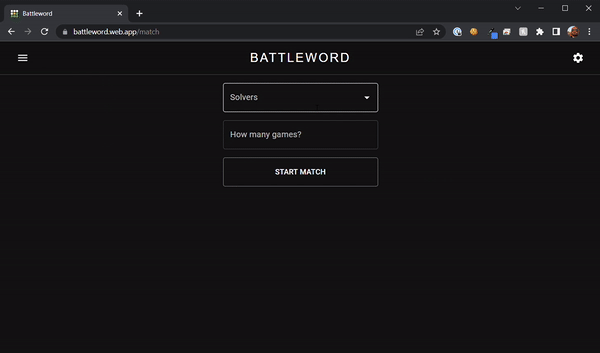

# Battleword
Wordle is cool right now

## What is Battleword
Battleword is a competition to see who can come up with the fastest/most accurate/shoutiest wordle solver.

Players host an api, then the battleword engine will make a `POST` request to their api with the state of a Wordle (starting empty).

The player's api should then respond to the state of the game in the body of the post with their best guess. As soon as the battleword engine hears back from them, it will send the results of their guess in a new request. It will do that until the player's api guesses correctly, or they reach the guess limit.

## What is Wordle
In case you haven't been on the internet over the last few months, [Wordle](https://www.nytimes.com/games/wordle/index.html) is a word game where you make attempts at guessing a secret word. You get a response once you make your guess with a colour for each letter. 

Battleword maps the colours you know and love in Wordle to the following numbers:

| Colour | Number | Meaning                                       |
| ------ | ------ | --------------------------------------------- |
| 🟩      | 2      | Letter is in the word and in the correct spot |
| 🟨      | 1      | Letter is in the word but in a different spot |
| ⬛      | 0      | Letter is not in the word                     |

I have coded the Battleword engine to give results in the exact same way as Wordle with respect to double letters, greens over yellows, left to rightishness etc. If you find an inconsistency between how I've done it and the Wordle engine please file an issue.

## Quickstart

1. Download the latest release for your OS and unpack
2. Run `solvo` (double click) - this starts solvo the solver. He will listen for game states from engine.
3. Run `engine` - this starts sending game states to solvo. With every guess solvo makes, engine will send a new request to solvo with the results of his previous guess. Solvo will ignore those results and choose a completely random word to send next. Your solver should do better than solvo.

There is also a naive solver named `howyagoin`, named so because he's a bit howyagoin. He uses a fairly simple approach but still does ok. He doesn't use any of the techniques in `schwordler` that I stole from youtube videos, so it's very possible to do better than `howyagoin` if you too have access to Youtube or are good at maths.

## Setup
To test your own guesser against the engine, create an api that implements the schema below. Once you've done that, run the engine against the api location of your solver like so:

```
./engine --apis http://localhost:8081
```

You can specify multiple solvers to compete against each other:
```
./engine --apis http://localhost:8081,http://localhost:8080
```

NB these commands are executed in a command line of your choice. Exact syntax may change based on your OS.

## API
This is what all solvers need to implement. For each endpoint you will receive the request shown from the game engine, and have to respond with the response shown. If you do not format your response according to what's listed below you will receive an error. Timeout for each request is 300 seconds. 
### /guess
The engine will hit your api here with the previous results of a game. You are expected to respond with your best guess.
Each `guess_results` object also comes with the start and finish time, plus an ID that correlates to the header `guessID` that gets sent with each request. I've omitted those fields from this JSON for brevity. Solvo prints out the full body when you run him.
#### Request:
```json
{
    "game_id": "3bead1b6-cd41-4bd0-9ec0-9b451319efba",
    "guess_results": [
        {
            "guess": "tense",
            "result": [ 1, 0, 0, 0, 0 ]
        },
        {
            "guess": "finer",
            "result": [ 0, 1, 0, 0, 1 ]
        },
        {
            "guess": "unset",
            "result": [ 0, 0, 0, 0, 2 ]
        },
        {
            "guess": "cable",
            "result": [ 0, 0, 0, 0, 0 ]
        },
        {
            "guess": "deity",
            "result": [ 2, 0, 1, 1, 0 ]
        }
    ],
    "guess_durations_ns": [ 1002925700, 1001538400, 1000738000, 1000947200, 1000960600 ]
}
```
#### Response:
```json
{
	"guess": "rumba",
	"shout": "why is everybody shouting"
}
```
Shouts server no purpose except to intimidate your opponents.

### /ping
In order to get the definition of your character, the engine will ping you. This is also run at the start of each match up to 10 times in order to wake up your server if you're hosting it in 'serverless' land where there are still servers but I assume the name refers to a lack of reliable servers.

`concurrent_connection_limit` specifies how many concurrent requests you are happy with. It will also ensure that only `concurrent_connection_limit + 2` games are ever active at once for each player so you don't get a scenario where you have to make all 100 first guesses before being sent the second guess. If you are a big dog, you can crank this as high as you like in your ping response. 

`colour` is spelt colour because this is a civilised repo. It is used as the colour for your part of the statistics in the UI. It has to be of the format `#FFFFFF` (not case sensitive though). If you leave it out I use a hash of your description instead so you'll end up being some random colour you're not happy with.


#### Request:
GET request - no payload
#### Response:
```json
{
    "name": "solvo",
    "description": "the magnificent",
    "concurrent_connection_limit": 10,
    "colour": "#7e0391"
}
```
There will be more things here in the future. stay posted.

### /results
Once all players are finished, the engine will send you the results of everyone in the match. No response is required, except maybe to message your friends to brag. `player_id` represents your ID, look for the corresponding player in the `players` array to see how you went.
As with the request, all objects come with an ID, start, and end time that has been omitted for brevity. Check Solvo for the exact body. 
#### Request:
```json
{
    "player_id": "9fda863c-f303-47da-a8f0-35b0b84b1abe",
    "results": {
        "match_id": "777f785b-d2f9-4467-990e-e2f90efe3b52",
        "players": [
            {
                "player_id": "9fda863c-f303-47da-a8f0-35b0b84b1abe",
                "definition": {
                    "name": "solvo",
                    "description": "the magnificent"
                },
                "games_played": [
                    {
                        "game_id": "3bead1b6-cd41-4bd0-9ec0-9b451319efba",
                        "guess_results": [
                            {
                                "guess": "tense",
                                "result": [ 1, 0, 0, 0, 0 ]
                            },
                            {
                                "guess": "finer",
                                "result": [ 0, 1, 0, 0, 1 ]
                            },
                            {
                                "guess": "unset",
                                "result": [ 0, 0, 0, 0, 2 ]
                            },
                            {
                                "guess": "cable",
                                "result": [ 0, 0, 0, 0, 0 ]
                            },
                            {
                                "guess": "deity",
                                "result": [ 2, 0, 1, 1, 0 ]
                            },
                            {
                                "guess": "deter",
                                "result": [ 2, 0, 1, 0, 1 ]
                            }
                        ],
                        "guess_durations_ns": [ 1002925700, 1001538400, 1000738000, 1000947200, 1000960600, 1001443500 ]
                    }
                ],
            },
            {
                "player_id": "b6f3c0ed-c885-4253-8d23-725def324c55",
                "definition": {
                    "name": "schwordler",
                    "description": "the brave"
                },
                "games_played": [
                    {
                        "game_id": "3bead1b6-cd41-4bd0-9ec0-9b451319efba",
                        "guess_results": [
                            {
                                "guess": "crane",
                                "result": [ 0, 2, 0, 0, 0 ]
                            },
                            {
                                "guess": "droit",
                                "result": [ 2, 2, 2, 2, 2 ]
                            }
                        ],
                        "correct": true,
                        "guess_durations_ns": [ 2135600, 1794700 ]
                    }
                ],
            }
        ],
        "games": [ { "game_id": "3bead1b6-cd41-4bd0-9ec0-9b451319efba", "answer": "droit" } ],
        "rounds_per_game": 6,
        "letters_per_word": 5
    }
}
```
## Competing
Once you have your solver set up, it's time to compete. Head to the [Battleword Official Website](https://battleword.web.app/) and onboard your solver [here](https://battleword.web.app/onboard). Paste the full URL of your solver and if it correctly returns a response to the `/ping` endpoint with a name no one else is using yet, it will add your solver to the list of solvers people can compete against.

Start a game [here](https://battleword.web.app/match) and watch the solvers go at it.


There is a cornucopia of statistics further down that page, if you didn't get around to building something to analyse your solver's performance yourself.

## Tech used
### Deploy
- [goreleaser](https://goreleaser.com/) is awesome. Use it for all your releases.
- Github actions with auto deploy to Firestore
- Identity Federation meaning roughly key management as a service I guess. [Details.](https://github.com/brensch/battleword-cloud-engine/blob/main/README.md?plain=1#L10)

### Backend
- GCP Cloud Run - ok for hosting the services being used (read, completely free and 0 config deploy)
- GCP is the only cloud that doesn't make me feel like I'm working

### Frontend
- React/Typescript. Don't look at the code I'm not proud of it. [An exercise in how fast you can make a frontend.](https://github.com/brensch/battleword-ui)
- Firestore - bae. In backend and frontend actually. Means I just didn't need an API for the frontend. Always a good time.
- Firebase hosting - brainless deployment but always surprises me googlists didn't think of a better name for it.

## Fun Facts
- I spent some time investigating but can't figure out why but unmarshalling guesses from solvers takes about 100ms in the cloud when an average laptop takes less than a few nanoseconds. I tried ramping up the compute for a bit to see if it improved but it didn't. Because of this, most solver response time will be dominated by this Serverless Tax and thus you should probably only focus on your accuracy, and making sure your guess takes less than 100ms. 
- Every time I add a new git tag it gets built and released automatically for your consumption. The cloud engine will always be running the latest tag. If you are prototyping against a local version of the engine, take note of which version you are using in case I decide to break the API in the latest tag.

